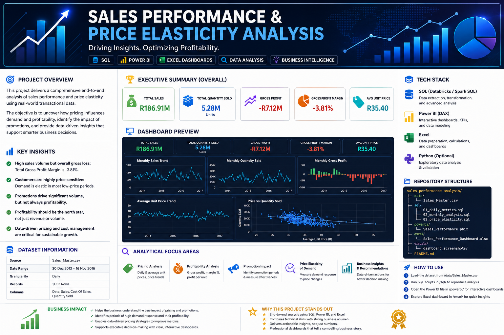

# 📈 Sales Performance & Price Elasticity Analysis

<p align="center">
  
</p>


</p>

---


## 🧠 30-Second Read

> **R186.91M in sales. 5.28M units sold. Still a R7.12M gross loss.**
> This project finds out why growth was not paying off — and shows exactly what to change.

I analysed 3 years of daily sales data (SQL → Excel → Power BI) to answer a question most sales dashboards never ask: **is this growth actually worth having?** The answer was no — and the data shows precisely where the value was leaking and how to stop it.

---

## 🏆 Executive Summary

| KPI                            |                 Result |
| :----------------------------- | ---------------------: |
| 💰 Total Sales                 |    **R186.91 Million** |
| 📦 Total Quantity Sold         | **5.28 Million Units** |
| 💵 Gross Profit                |     **-R7.12 Million** |
| 📉 Gross Profit Margin         |             **-3.81%** |
| 🏷️ Average Unit Selling Price |             **R35.40** |

**Key finding:** despite substantial revenue and volume, the product recorded an overall gross loss. **High sales volume does not automatically mean high profitability** — and the data shows demand here is highly price-sensitive, meaning promotions were likely driving units at the expense of margin.

---

## 💡 Key Insights

1. **Volume without value.** ~R186.91M in sales and 5.28M units sold still produced a net gross loss of R7.12M — revenue and unit counts were rising while profitability was not, the core disconnect this project set out to explain.
2. **Customers are price-sensitive.** Periods of lower selling price consistently lined up with stronger demand, a signature of elastic demand — discounting moves units fast, but every point of price cut compounds against margin.
3. **Promotions moved volume, not necessarily value.** Promotional periods look successful on a units-sold view and materially weaker on a profit-per-unit view — the two tell different stories from the same data.
4. **Price and profit need to be watched together.** No single metric (sales, units, or price alone) explained the loss — it only became visible once price, cost, and quantity were modelled together as elasticity.

---

## 🎯 Business Recommendations

| # | Recommendation | Expected impact |
|---|---|---|
| 1 | **Review pricing strategy** — ensure selling price consistently covers cost of sales | Removes the structural cause of the gross loss |
| 2 | **Optimise promotional pricing** — test discount depths that stimulate demand without dropping below margin-safe thresholds | Keeps the demand lift from promotions without the profit leak |
| 3 | **Monitor unit economics** — track gross profit per unit alongside sales volume, not sales volume alone | Catches value-destroying growth before it compounds |
| 4 | **Prioritise profitable growth** — stop treating revenue and unit growth as success metrics in isolation | Reframes decision-making around margin, not vanity metrics |
| 5 | **Build a live pricing performance dashboard** — price, quantity, margin and elasticity in one view | Turns this from a one-off finding into an ongoing early-warning system |

**Bottom line for the business:** pricing is a powerful lever for demand, but without a profitability check attached, it's a lever that can pull the business in the wrong direction. The fix isn't to sell less — it's to know, in real time, which sales are actually worth making.

---

# 🎯 Project Overview

This project delivers an end-to-end analysis of **sales performance, profitability, pricing, promotions, and Price Elasticity of Demand** using transactional sales data.

The objective was not simply to report sales figures, but to answer an important business question:

> **Does selling more units and reducing prices actually create value for the business?**

Using **SQL, Excel, Power BI, and business analysis techniques**, this project investigates how changes in selling price influence customer demand and whether increased sales volume translates into improved profitability.

---

# 📂 Dataset Information

Each record represents sales activity for a specific day.

| Column           | Description                           |
| :--------------- | :------------------------------------ |
| 📅 Date          | Day on which sales occurred           |
| 💰 Sales         | Total Rand value of sales             |
| 💵 Cost Of Sales | Total Rand cost associated with sales |
| 📦 Quantity Sold | Total number of units sold            |

### Dataset Summary

* **Period:** December 2013 – November 2016
* **Granularity:** Daily
* **Records:** 1,053
* **Focus:** Sales, pricing, demand and profitability

---

# ❓ Business Questions

The project was designed to answer the following questions:

### 💰 Pricing Analysis

1. What is the daily sales price per unit?
2. What is the average selling price of the product?
3. How does price change over time?

### 📈 Profitability Analysis

4. What is the daily gross profit percentage?
5. What is the gross profit generated per unit?
6. Are high sales periods also profitable?

### 🏷️ Promotion Analysis

7. Which periods show evidence of promotional pricing?
8. How does customer demand respond to lower prices?
9. Does the product perform better or worse during promotional periods?

### 🧠 Advanced Business Analysis

10. What is the Price Elasticity of Demand?
11. Is demand elastic or inelastic?
12. What recommendations can improve sustainable profitability?

---

# 🧮 Key Metrics & Calculations

## 🏷️ Daily Sales Price per Unit

```text
Sales Price per Unit = Total Sales ÷ Quantity Sold
```

This metric measures the effective selling price of one unit on a particular day.

---

## 💰 Average Unit Sales Price

```text
Average Unit Sales Price = Total Sales ÷ Total Quantity Sold
```

A weighted calculation was used to ensure that high-volume days have the appropriate influence on the overall average.

---

## 💵 Gross Profit

```text
Gross Profit = Sales − Cost of Sales
```

---

## 📊 Gross Profit Margin

```text
Gross Profit % = Gross Profit ÷ Sales × 100
```

---

## 📦 Gross Profit per Unit

```text
Gross Profit per Unit = Gross Profit ÷ Quantity Sold
```

This metric helps determine whether each additional unit sold is contributing positively to profitability.

---

## 📉 Price Elasticity of Demand

Price Elasticity of Demand measures how strongly customer demand responds to changes in price.

```text
Price Elasticity of Demand =
% Change in Quantity Demanded ÷ % Change in Price
```

### Interpretation

| Elasticity | Meaning                                                      |
| :--------- | :----------------------------------------------------------- |
| `> 1`      | 🔥 Elastic demand – customers are highly responsive to price |
| `< 1`      | 🧱 Inelastic demand – customers are less responsive to price |
| `= 1`      | ⚖️ Unit elastic                                              |
| Negative   | Normal when price and demand move in opposite directions     |

---

# 🔍 Analytical Approach

The project followed a structured data analytics workflow:

```text
Raw Data
   ↓
Data Validation & Cleaning
   ↓
Exploratory Data Analysis
   ↓
Pricing & Profitability Metrics
   ↓
Promotion Identification
   ↓
Price Elasticity Analysis
   ↓
Business Insights & Recommendations
   ↓
Interactive Dashboards
```

---

# 🛠️ Tech Stack

| Tool                   | Purpose                                                    |
| :--------------------- | :--------------------------------------------------------- |
| 🗄️ SQL / Databricks   | Data extraction, transformation and analysis               |
| 📊 Power BI            | Data modelling, DAX measures and interactive dashboards    |
| 📗 Excel               | Calculations, exploratory analysis and executive dashboard |
| 🐍 Python *(Optional)* | Further validation and advanced analysis                   |

---

# 💻 SQL Analysis

SQL was used to calculate the core business metrics and analyse trends.

### Key SQL Concepts Used

* `SELECT`
* `WHERE`
* `ORDER BY`
* `GROUP BY`
* Aggregate Functions (`SUM`, `AVG`, `COUNT`)
* `CASE WHEN`
* Common Table Expressions (CTEs)
* Window Functions
* `LAG()`
* Date Functions

### Example: Unit Sales Price

```sql
SELECT
    Date,
    Sales,
    `Quantity Sold`,
    ROUND(
        Sales / NULLIF(`Quantity Sold`, 0),
        2
    ) AS Daily_Sales_Price_Per_Unit
FROM sales_master
ORDER BY Date;
```

### Example: Gross Profit Margin

```sql
SELECT
    Date,
    Sales - `Cost Of Sales` AS Gross_Profit,

    ROUND(
        (Sales - `Cost Of Sales`)
        / NULLIF(Sales, 0) * 100,
        2
    ) AS Gross_Profit_Percentage
FROM sales_master
ORDER BY Date;
```

---

# 📊 Power BI & DAX

Power BI was used to transform the analysis into an interactive business dashboard.

### Core DAX Measures

#### Total Sales

```DAX
Total Sales =
SUM('Sales Master'[Sales])
```

#### Total Quantity Sold

```DAX
Total Quantity Sold =
SUM('Sales Master'[Quantity Sold])
```

#### Gross Profit

```DAX
Gross Profit =
SUM('Sales Master'[Sales])
-
SUM('Sales Master'[Cost Of Sales])
```

#### Gross Profit %

```DAX
Gross Profit % =
DIVIDE(
    [Gross Profit],
    [Total Sales],
    0
)
```

#### Average Unit Sales Price

```DAX
Average Unit Sales Price =
DIVIDE(
    [Total Sales],
    [Total Quantity Sold],
    0
)
```

#### Gross Profit per Unit

```DAX
Gross Profit Per Unit =
DIVIDE(
    [Gross Profit],
    [Total Quantity Sold],
    0
)
```

---

# 📈 Dashboard Preview

The dashboard was designed to tell a clear business story:

### 1️⃣ What happened?

Sales performance and demand trends.

### 2️⃣ Was it profitable?

Gross profit, margins and unit economics.

### 3️⃣ How did customers respond to pricing?

Price trends, promotional periods and demand response.

### Key Dashboard Visuals

📈 **Monthly Sales Trend**
📦 **Monthly Quantity Sold Trend**
💵 **Gross Profit Performance**
🏷️ **Average Unit Price Trend**
📉 **Price vs Quantity Relationship**
🔥 **Promotion Performance Analysis**
📊 **Price Elasticity Analysis**

> 📌 Add your dashboard screenshot here once uploaded:

```markdown

```

---

# 🗂️ Repository Structure

```text
sales-performance-price-elasticity-analysis/
│
├── data/
│   └── Sales_Master.xlsx
│
├── sql/
│   ├── 01_daily_metrics.sql
│   ├── 02_monthly_analysis.sql
│   └── 03_price_elasticity.sql
│
├── powerbi/
│   └── Sales_Performance_Dashboard.pbix
│
├── excel/
│   └── Sales_Performance_Dashboard.xlsx
│
├── visuals/
│   └── dashboard_screenshot.png
│
├── assets/
│   └── Sales-Performance-Banner.png
│
└── README.md
```

---

# 🚀 How to Explore This Project

### Step 1️⃣ — Explore the Dataset

Review the raw sales data and understand the available measures.

### Step 2️⃣ — Run the SQL Analysis

Use the SQL scripts to reproduce the calculations and insights.

### Step 3️⃣ — Explore the Excel Dashboard

Open the Excel dashboard to investigate sales, pricing and profitability trends.

### Step 4️⃣ — Explore Power BI

Interact with the Power BI dashboard and compare KPIs across different periods.

### Step 5️⃣ — Draw Business Conclusions

Use the analysis to evaluate whether pricing and promotions are creating sustainable business value.

---

# 🌟 Why This Project Stands Out

This project demonstrates more than technical calculations.

It shows the ability to:

✅ Translate raw data into business questions
✅ Build meaningful KPIs
✅ Analyse pricing and profitability
✅ Apply Price Elasticity of Demand concepts
✅ Use SQL for analytical problem-solving
✅ Build calculations using DAX
✅ Create executive-ready dashboards
✅ Communicate insights and recommendations clearly

> **The goal of a Data Analyst is not just to find numbers—it is to explain what those numbers mean and help the business make better decisions.**

---

# 👩🏽‍💻 Author

**Data Analyst Portfolio Project**

### Skills Demonstrated

`SQL` • `Excel` • `Power BI` • `DAX` • `Data Analysis` • `Business Intelligence` • `Data Visualisation` • `Pricing Analytics` • `Business Insights`

---

<p align="center">
  ⭐ If you found this project interesting, feel free to explore the analysis and dashboards.
</p>


